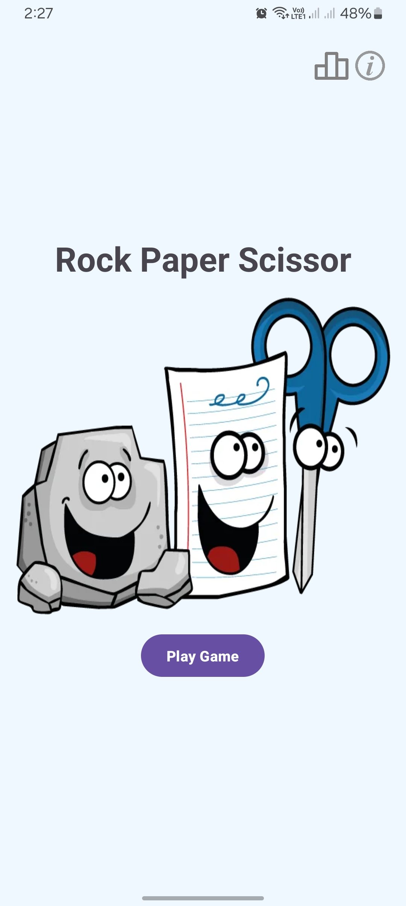
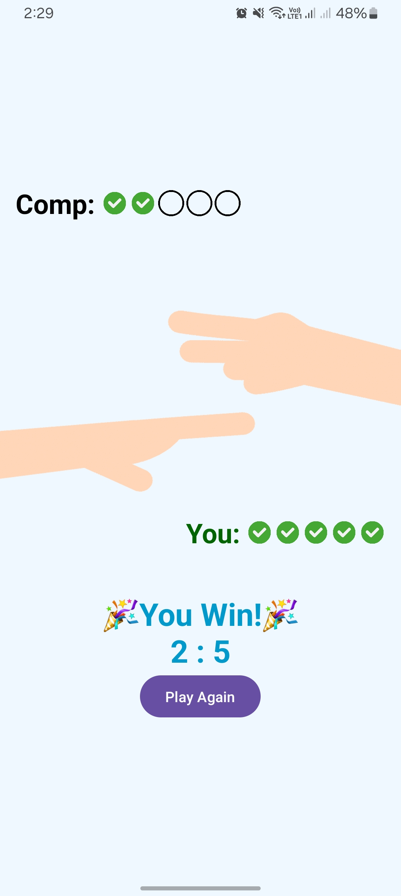

# Rock-Paper-Scissors 🪨📃✂️
A classic Rock-Paper-Scissors game for Android. 

## Features:
- Smooth single player gameplay
- Play against Com
- Track your game statistics (Wins, Loses, Draws, Streaks etc.)
- Engaging animations and sound effects

## Getting Started
1. Download the APK file from [Releases](https://github.com/almahfuz777/Rock-Paper-Scissor/releases) section 
2. Install it on your android device

## Screenshots

## Contributing
You are welcome for contributions to the project. If you find bug fixes, improvements, or new features, feel free to fork the repository and submit a pull request.
